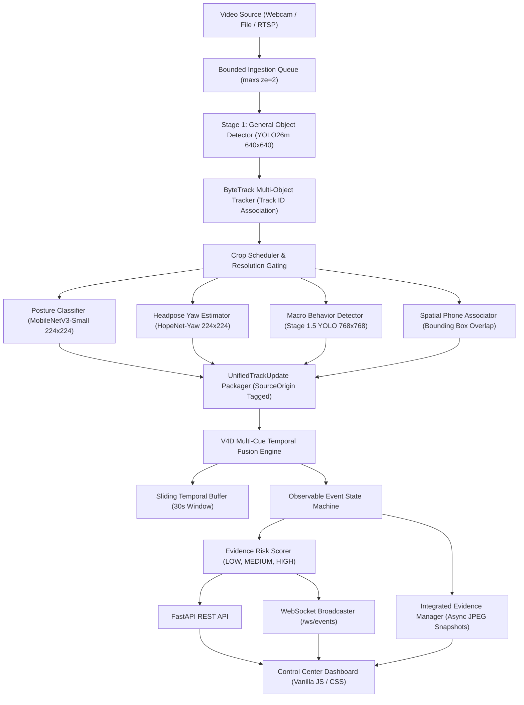

# ExamGuard Vision — Architecture & Pipeline Design

ExamGuard Vision is a real-time, multi-stage computer vision and temporal behavior fusion system engineered for exam room proctoring assistance.

---

## 1. System Architecture Overview

The system processes video input sequentially through dedicated perception, tracking, feature extraction, temporal fusion, and presentation layers:

---

## 2. Perception & Feature Extraction Pipeline

### 2.1 Stage 1: Detection & Tracking
- **Object Detection (`yolo26m.pt`)**: Detects `person` and `cell phone` objects in the full frame (640x640).
- **Multi-Object Tracking (`ByteTrack`)**: Assigns persistent track IDs across frames using a Kalman filter and bipartite matching, with high/low confidence association steps to survive momentary occlusions.

### 2.2 Feature Extraction Models
- **Posture Classification (`v4_posture_best.pt`)**:
  - Architecture: MobileNetV3-Small (4 classes: `NORMAL_UPRIGHT`, `NORMAL_READ_WRITE`, `HEAD_REST_SLEEP`, `TURN_HEAD_CLEAR`).
  - Input: Normalized upper-body crop (224x224 RGB).
- **Headpose Yaw Estimation (`v4_headpose_yaw_best.pt`)**:
  - Architecture: HopeNet-Yaw with circular regression.
  - Output: Continuous head yaw angle in degrees ($[-99^\circ, +99^\circ]$).
- **Spatial Phone Association**:
  - Geometry-based bounding box proximity between detected phones and active person tracks.

---

## 3. V4D Temporal Fusion & State Machine

Single-frame observations are inherently noisy. The V4D engine uses temporal aggregation to ensure stability:

1. **Sliding Temporal Window (30s buffer)**: Stores timestamped cue vectors for each active track.
2. **Anti-Double-Counting**: De-correlates posture classification (`TURN_HEAD_CLEAR`) from continuous head yaw angles (`HopeNet-Yaw`) to prevent runaway risk inflation.
3. **Event State Machine Transitions**:
   - `INACTIVE`: Normal behavior.
   - `CANDIDATE`: An anomaly is detected for $\ge$ minimum candidate duration (e.g. 0.5s).
   - `ACTIVE`: Sustained abnormal behavior exceeds event threshold (e.g. 1.5s for lateral orientation, 2.0s for sustained head rest). Triggers snapshot capture and WebSocket broadcast.
   - `COOLDOWN`: Behavior returns to normal; event stays open during cooldown period before closing.
   - `CLOSED`: Event is archived in memory awaiting proctor human review.

---

## 4. Evidence & Human-in-the-Loop Governance

- **Immutable Fact-Based Snapshots**: Snapshots are captured at the exact moment of event opening and stored locally as JPEG files.
- **Reviewer Decoupling**: AI never concludes "cheating". The system categorizes observable behaviors. Human proctors submit `CONFIRMED` or `DISMISSED` actions with optional notes via the dashboard.
- **Source Origin Provenance**: Every event preserves its origin (`PHYSICAL_LIVE_CAMERA`, `SOFTWARE_VALIDATION_FIXTURE`, `REPLAY_STREAM`, `VIDEO_FILE`, `RTSP_STREAM`).
