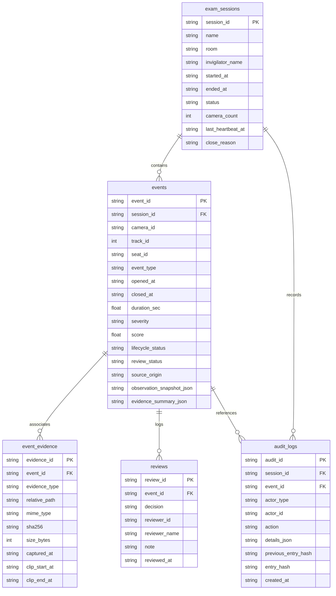

# ExamGuard Vision — Persistence & Evidence Architecture

## 1. Executive Summary & Core Principles

ExamGuard Vision has evolved from an in-memory live AI monitoring dashboard into a robust, transactional **exam monitoring evidence system**. In edge deployments (such as an invigilator laptop in an examination room), network connectivity to external servers may be unreliable or unavailable. Therefore, the persistence and evidence subsystem is designed with the following foundational principles:

- **Offline-First & Self-Contained:** Uses an embedded SQLite database engine with zero external database server dependencies.
- **One-Click Zero-Setup Startup:** The operator never encounters blocking modal setups for session names or rooms. A monitoring session is automatically initialized with sensible timestamps on startup, while metadata remains editable in the UI.
- **Safe Hardware Decoupling:** Video evidence ring buffers store bounded compressed JPEG frames rather than uncompressed video arrays. Clip encoding runs asynchronously outside the critical AI inference path.
- **Path Isolation & Privacy:** All persistent storage paths are repo-relative (`storage/db/`, `storage/sessions/`). Machine-specific absolute filesystem paths are strictly forbidden in databases, manifests, and web APIs.
- **Integrity & Tamper-Evidence:** Evidence files (snapshots, clips, manifests) are hashed with SHA-256 upon completion. Audit log entries are linked in a tamper-evident cryptographic hash chain.

---

## 2. Session Lifecycle & Crash Recovery

### 2.1 Automatic Session Lifecycle
When the application starts via `Start ExamGuard Vision.bat`:
1. The persistence subsystem checks for any existing session marked `ACTIVE`.
2. If an active session exists from a previous process that did not shut down cleanly, it is identified as **stale**. The system marks it as `INTERRUPTED`, setting its termination timestamp conservatively to its last recorded heartbeat.
3. A fresh monitoring session is created (e.g. `Phiên giám sát 04/10/2026 13:30`) and set to `ACTIVE`.
4. While the pipeline operates, a background task periodically issues heartbeats (`last_heartbeat_at`).
5. When the user executes `Stop ExamGuard Vision.bat` or closes the application gracefully, the active session is transitioned to `CLOSED` with `close_reason = "GRACEFUL_STOP"`.

### 2.2 ByteTrack Transient ID Semantics
ByteTrack assigns sequential tracking numbers to observed bounding boxes. **Track IDs are observational session metadata, not student identities.**
If a candidate leaves the camera frame and re-enters after the tracking timeout expires, they will receive a new track ID. ExamGuard Vision explicitly avoids facial recognition and does not imply identity from track IDs. The UI and documentation present all track references as temporary camera observations (e.g. `Thí sinh #2`).

---

## 3. Database Schema Overview

The database is located at `storage/db/examguard.sqlite3` and operates with:
- `PRAGMA foreign_keys = ON;`
- `PRAGMA journal_mode = WAL;`
- `PRAGMA busy_timeout = 10000;`
- `PRAGMA synchronous = NORMAL;`

Database schema versioning is managed via `schema_meta` (`version = 1`).

### Tables & Relationships



---

## 4. Evidence Flow & Bounded Ring Buffer

Evidence generation provides verifiable factual records for human invigilator review:

```
Camera Stream (1280x720 @ 30 FPS)
  │
  ├──> Perception Pipeline (Detector, Tracker, Posture, Yaw, Macro)
  │
  └──> Bounded Evidence Ring Buffer (Shared per camera)
         ├── Compressed JPEG Frames (~80-120 KB/frame)
         ├── Target Buffer Rate: 8.0 FPS
         ├── Pre-roll Capacity: 5.0 seconds
         └── Max Memory Limit: 64 MB per camera
```

### Event Lifecycle & Clip Writing
1. **Event OPEN:** 
   - Pre-persists the `PersistedEvent` row into SQLite immediately (`lifecycle_status = "ACTIVE"`) with authentic event type, opening timestamp, and track metadata. This guarantees that asynchronous background snapshot capture and hashing never violates transactional foreign key constraints (`PRAGMA foreign_keys = ON;`).
   - Captures an immutable high-resolution observation snapshot (`snapshot.jpg`).
   - Marks the pre-roll timestamp from the ring buffer.
   - Computes SHA-256 and writes snapshot metadata to SQLite once ready.
2. **Event ACTIVE:** 
   - Incoming frames continue to be tracked in the ring buffer.
   - Throttled metric updates are synced to SQLite without overloading DB I/O.
   - Updates observation state and refines best-frame candidates without creating duplicate queue cards or redundant artifact rows.
3. **Event CLOSE:** 
   - Waits for the post-roll duration (default: 5.0s).
   - Locks event timestamps (`closed_at`, `duration_sec`), updates `lifecycle_status = "CLOSED"` and final severity.
   - Asynchronously dispatches an evidence clip job to a bounded background worker.
   - Assembles frames and writes to a temporary file (`clip.tmp.mp4`).
   - Upon completion, atomically renames to `clip.mp4` and computes SHA-256.
   - Generates an immutable `manifest.json` documenting event metadata and model provenance.
   - If video encoding encounters an error, the snapshot remains preserved, the failure is logged to audit records, and the AI pipeline continues unimpeded.

---

## 5. Evidence Manifest & Provenance

Each incident folder under `storage/sessions/<session_id>/evidence/<event_id>/` contains a self-contained `manifest.json`:
- **Event Metadata:** ID, session, camera, track ID, event type, timestamps, severity, and scores.
- **Evidence Files:** File names, sizes, MIME types, and SHA-256 digests.
- **AI Model Provenance:** Checkpoint names, paths, and canonical cryptographic hashes (e.g. YOLO26m, MobileNetV3, HopeNet-Yaw, Stage 1.5).

```json
{
  "manifest_version": "1.0.0",
  "event_id": "ev_1728001000_a1b2",
  "session_id": "sess_1728000000_1234",
  "camera_id": "webcam_0",
  "track_id": 3,
  "event_type": "PHONE_ASSOCIATED",
  "severity": "HIGH",
  "score": 92.0,
  "opened_at": "2026-10-04T13:30:00.120Z",
  "closed_at": "2026-10-04T13:30:12.450Z",
  "snapshot": {
    "filename": "snapshot.jpg",
    "sha256": "e3b0c44298fc1c149afbf4c8996fb92427ae41e4649b934ca495991b7852b855"
  },
  "clip": {
    "filename": "clip.mp4",
    "sha256": "4b227777d4dd1fc61c6f884f48641d02b4d121d3fd328cb08b5531fcacdabf8a"
  },
  "models": [
    { "role": "detector", "name": "yolo26m.pt", "sha256": "..." },
    { "role": "posture", "name": "v4_posture_best.pt", "sha256": "..." },
    { "role": "headpose", "name": "v4_headpose_yaw_best.pt", "sha256": "..." }
  ]
}
```

---

## 6. Audit Trail & Tamper-Evident Chaining

To maintain an unalterable operational log:
- Actions such as `SESSION_CREATED`, `EVENT_OPENED`, `EVENT_CONFIRMED`, `EVENT_DISMISSED`, `BACKUP_CREATED`, and `RETENTION_PREVIEW` are appended to `audit_logs`.
- Each log entry calculates:
  $$\text{entry\_hash} = \text{SHA-256}(\text{audit\_id} \parallel \text{action} \parallel \text{session\_id} \parallel \text{created\_at} \parallel \text{details\_json} \parallel \text{previous\_entry\_hash})$$
- The chain can be verified at any time using `inspect_examguard_db.py`.

---

## 7. Local Backup Architecture & Verification

A persistent database is not a backup. A dedicated transactional backup facility is provided:

### 7.1 Backup Procedure
- Uses the official `sqlite3.Connection.backup()` API to snapshot the active database without locking or corrupting concurrently running writes.
- Copies session evidence files to `backups/YYYY-MM-DD/examguard-backup-<timestamp>/`.
- Calculates SHA-256 for the backed-up database and all evidence files.
- Generates `backup-manifest.json`.
- Runs immediate self-verification before confirming success to the operator.

### 7.2 Verification CLI
A standalone, read-only utility is available to verify backups on any machine without starting the application:
```powershell
.\.venv\Scripts\python.exe tools/validation/verify_backup.py backups/2026-10-04/examguard-backup-20261004_130851
```

---

## 8. Retention Policy (Default Safe)

Data retention is strictly **disabled by default** (`retention.enabled = false`):
- No evidence or session data is automatically deleted.
- If enabled in configuration, retention rules (e.g. 30 days for dismissed events, 90 days for confirmed events) can be previewed using `GET /api/retention/preview`.
- Any eventual deletion requires explicit manual execution and produces full audit log records.

---

## 9. Privacy Disclaimer & Data Handling

1. **Identifiable Data:** ExamGuard evidence files contain real images and video clips of individuals taking examinations. Institutions deploying ExamGuard must comply with all applicable privacy, educational, and legal regulations regarding recording and surveillance.
2. **No Biometric Identification:** The system performs behavior analysis only. It does not perform face recognition, cross-camera identity matching, or demographic classification.
3. **No Overclaiming:** SHA-256 checksums verify file integrity against accidental corruption or post-hoc tampering. They do not constitute legal cryptographic non-repudiation.

---

## 10. Operational Status & Production Gaps

| Capability | Status | Notes |
| :--- | :---: | :--- |
| **Single-Camera Room Pilot** | **READY** | Validated on ASUS TUF Gaming A17 |
| **SQLite Session Persistence** | **ACTIVE** | Auto-created, crash recovery, graceful shutdown |
| **Evidence Snapshots & Clips** | **ACTIVE** | Pre-roll / post-roll bounded ring buffer |
| **SHA-256 Evidence Integrity** | **ACTIVE** | Stored in DB, verified on demand in UI |
| **History Navigation View** | **ACTIVE** | Vietnamese session browser, detail replay |
| **Local Transactional Backup** | **ACTIVE** | Manifest, checksums, verification tool |
| **Enterprise Production** | **NO** | Requires centralized DB, RBAC, encrypted storage |
