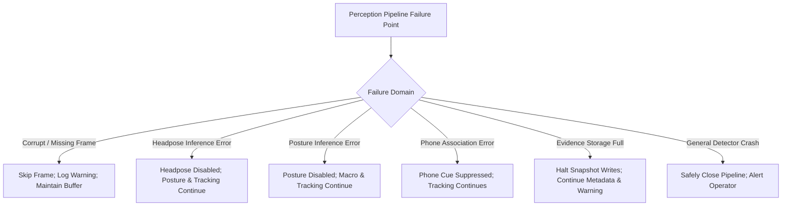

# FAILURE RECOVERY & SYSTEM DEGRADATION SPECIFICATION

## 1. Principles of Graceful Degradation
In a mission-critical examination monitoring environment, transient peripheral failures (e.g., camera packet loss, corrupted frames, secondary model timeouts) must never terminate the core ingestion pipeline.

---

## 2. Component-Level Failure Modes & Containment

### 2.1. Frame Corruption & Decode Gaps
- **Failure Trigger**: Packet drop in RTSP transport or corrupt H.264 NAL unit resulting in `None` frame from decoder.
- **Handling**:
  - Decoder logs warning and drops corrupted frame without throwing unhandled exception.
  - Pipeline advances monotonic stream clock or pauses temporal buffer based on timestamp gap.
  - Ingestion queue depth is decremented; backpressure counter is updated.

### 2.2. Specialized Branch Inference Failures
- **Headpose Model Failure**:
  - If `HopeNetYaw` encounters an invalid tensor or CUDA OOM during head crop forward pass, the exception is caught in `CropScheduler`.
  - Output is set to `HeadPoseCue(status=ObservationStatus.ERROR, yaw_deg=None)`.
  - Core pipeline continues uninterrupted; V4D fusion ignores head-pose cue for that frame.
- **Posture Model Failure**:
  - If `MobileNetV3` fails, output is set to `PostureCue(status=ObservationStatus.ERROR)`.
  - Upstream macro behavior detector and ByteTrack tracker continue executing normally.
- **Phone Spatial Association Failure**:
  - If bounding box geometry calculation fails (e.g., zero-area polygon), the exception is logged, association is set to `UNASSOCIATED`, and event opening is suppressed.

### 2.3. Evidence Storage & Disk Quota Exhaustion
- **Failure Trigger**: Target storage volume reaches critical quota threshold ($< 500\text{ MB}$ free or max storage exceeded).
- **Handling**:
  - `EvidenceRetentionManager` transitions status to `STORAGE_CRITICAL` / `STORAGE_EXHAUSTED`.
  - Disk snapshot and video clip writes are suspended immediately to prevent OS write faults.
  - Ingestion and tracking of student events continue in memory; event metadata is transmitted over WebSocket.
  - Dashboard surfaces `EVIDENCE_STORAGE_LOW` alert to invigilators.

### 2.4. Network Stream Interruption & Reconnection
- **Failure Trigger**: Physical network cable disconnect, RTSP server restart, or router drop.
- **Handling**:
  - Ingestion thread detects zero-frame timeout ($> 3.0\text{s}$) or decoder EOF.
  - Stream source enters exponential backoff reconnect cycle ($1.0\text{s}, 2.0\text{s}, 4.0\text{s}$, max $10.0\text{s}$).
  - Active ByteTrack tracks are frozen; tracks inactive for $> 15.0\text{s}$ are evicted cleanly.
  - Upon reconnection, pipeline resumes tracking without restarting system process.

---

## 3. Catastrophic Failures Requiring Pipeline Restart
The only failure mode permitting whole-pipeline shutdown is a fatal GPU driver crash or unrecoverable CUDA kernel error in the primary object detector (`yolo26m.pt`), where frame ingestion cannot physically proceed. In this event, the process cleanly closes open file handles, emits an emergency system log, and exits with non-zero error code for supervisor daemon restart.
