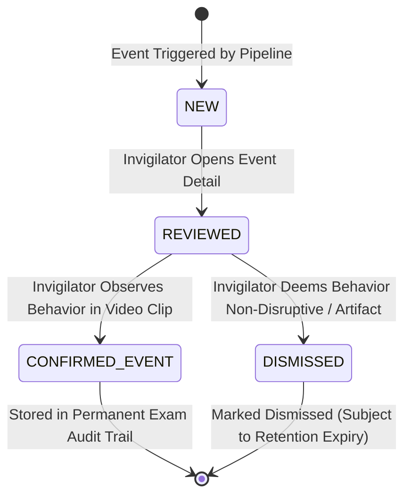

# OPERATOR WORKFLOW & HUMAN-IN-THE-LOOP DASHBOARD GUIDE

## 1. System Philosophy: Observability Over Adjudication
The automated CCTV monitoring pipeline functions strictly as a real-time perceptual aid for human exam invigilators.

> [!CAUTION]
> **Strict Governance Invariant**:
> The system **NEVER** issues verdicts of `CHEATING`, `CHEATER`, `GUILTY`, or `FRAUD`.
> All events emitted by the pipeline represent neutral, factual physical observations (e.g., `SUSTAINED_LATERAL_HEAD_ORIENTATION`, `SUSTAINED_HEAD_REST`, `PHONE_ASSOCIATED`, `DISCUSSION_CANDIDATE`, `STANDING`).
> Disciplinary determinations are the sole, non-delegable prerogative of trained human proctors and invigilators.

---

## 2. Invigilator Review State Workflow

Events detected by the pipeline enter a structured, auditable human-review lifecycle:

### Review State Definitions
| State Name | Assigned By | Strict Meaning | Prohibited Interpretation |
| :--- | :--- | :--- | :--- |
| **`NEW`** | Pipeline | Initial event creation. Unviewed by invigilator. Accompanied by audio/visual cue in UI. | Guilt or misconduct. |
| **`REVIEWED`** | Invigilator | Invigilator clicked event tile, examined video prebuffer clip or keyframe snapshot. | Guilt or innocence. |
| **`CONFIRMED_EVENT`** | Invigilator | **The physical event occurred as described** (e.g., the student turned their head laterally for $>3$ seconds). | **MUST NOT MEAN CHEATING**. The student may have been looking at a wall clock or seeking proctor attention. |
| **`DISMISSED`** | Invigilator | The physical event was transient, an optical artifact, or deemed harmless/unwarranted by the invigilator. | Automatic deletion of underlying evidence. |

---

## 3. Dashboard UI Elements & Layout

The operator interface is divided into four primary functional zones:

### Zone 1: Camera Grid & Live Video Tiles
- Displays low-latency live streams across monitored examination rooms.
- Overlay toggle for anonymous student tracking bounding boxes and seat zone outlines.
- Camera status indicator badge (Green = Healthy, Yellow = Degraded/Drop Warning, Red = Disconnected).

### Zone 2: Real-Time Event Feed
- Chronological list of incoming `NEW` events.
- Displays: Camera ID, Timestamp, Anonymous Track ID, Event Type, Configured Evidence Risk Category (`LOW`, `MEDIUM`, `HIGH`).
- One-click quick action to inspect keyframe snapshot.

### Zone 3: Detailed Evidence Review Drawer
- High-resolution keyframe snapshot displaying detected bounding boxes and head yaw vector overlay.
- 5-second video clip preview with synchronized timeline scrubber.
- Camera calibration capability warning summary (e.g., informs operator if head-pose is limited or phone visibility is degraded for that specific angle).
- State transition action buttons: `[Confirm Physical Event]` and `[Dismiss Event]`.
- Optional free-text invigilator note field.

### Zone 4: Camera Health & Resource Status Panel
Monitors real-time infrastructure metrics:
- **Source Connection**: Connected / Reconnecting / Disconnected.
- **Frame Rate**: Received FPS vs Processed FPS.
- **Drop Rate**: Real-time drop percentage over rolling 60-second window.
- **Queue Depth**: Ingestion buffer utilization.
- **Active Tracks**: Count of currently tracked students.
- **Capability Gating**: Real-time count of posture-eligible and headpose-eligible tracks.
- **Storage Status**: Evidence disk quota health (`HEALTHY`, `WARNING`, `CRITICAL`).

---

## 4. Operator Warning Indicators

When operational limits are reached, the dashboard surfaces non-blocking contextual alerts:
- ⚠️ **`LOW_PERSON_RESOLUTION`**: Student is too distant for reliable posture cues.
- ⚠️ **`HEADPOSE_UNAVAILABLE`**: Camera angle or head pixel size prevents facial yaw calculation.
- ⚠️ **`HIGH_FRAME_DROP_RATE`**: Ingestion backpressure is causing frame decimation ($> 15\%$).
- ⚠️ **`RTSP_RECONNECTING`**: Video feed interrupted; backoff reconnecting in progress.
- ⚠️ **`PHONE_VISIBILITY_LIMITED`**: Desk perspective hinders optical phone detection.
- ⚠️ **`DENSE_LOAD_DEGRADED`**: Room occupancy exceeds optimal line-rate capacity; throttling active.
- ⚠️ **`EVIDENCE_STORAGE_LOW`**: Disk space nearing quota limit; review retention policies.
