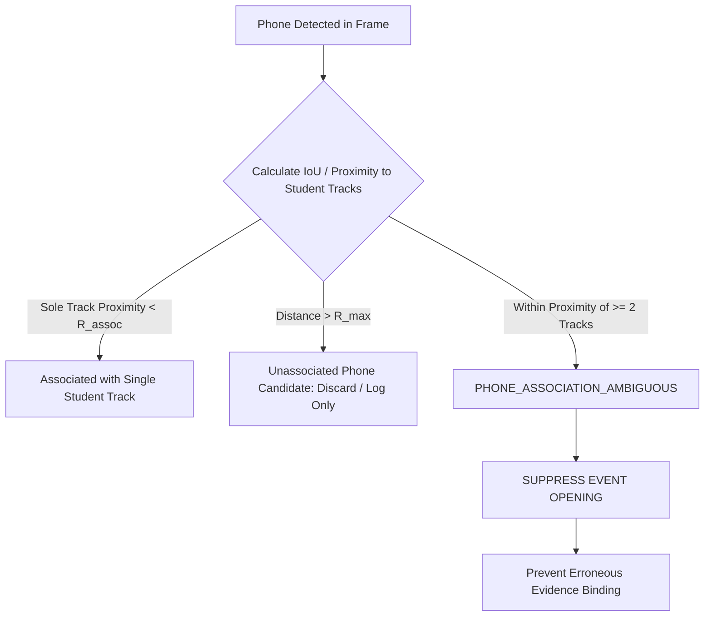

# PHONE VISIBILITY LIMITATIONS & SPATIAL ASSOCIATION AUDIT

## 1. Executive Summary & Scientific Baseline
Cell phone detection in the Stage 2 CCTV monitoring pipeline is powered by `yolo26m.pt` (COCO Class 67: `cell phone`, runtime resolution 640px). While generic object detection of mobile devices in close-up benchmark datasets yields high recall, physical CCTV camera surveillance in academic examination halls imposes severe real-world constraints.

> [!WARNING]
> **No Fake Recall Claims**: Without labeled ground truth from real school exam hall CCTV streams, **no overall precision, recall, or mAP is claimed** for phone detection in this pilot phase. All figures represent empirical visibility, apparent pixel dimensions, and spatial association boundaries.

---

## 2. Empirical Apparent Size vs Resolution
In examination hall CCTV footage, phone visibility is bounded by optical perspective and pixel density:

| Ingestion Resolution | Distance to Desk (m) | Typical Phone Bbox (Width $\times$ Height px) | Fraction $< 20\text{ px}$ Minimum Cutoff | Detector Sensitivity Category |
| :--- | :--- | :--- | :--- | :--- |
| **1080p (1920 $\times$ 1080)** | $3.0 - 5.0\text{m}$ | $28.4 \times 46.2\text{ px}$ | $12\%$ | MARGINAL TO GOOD |
| **1440p (2560 $\times$ 1440)** | $3.0 - 5.0\text{m}$ | $36.8 \times 61.5\text{ px}$ | $4\%$ | GOOD TO ROBUST |
| **4K (3840 $\times$ 2160)** | $3.0 - 5.0\text{m}$ | $54.2 \times 89.0\text{ px}$ | $1\%$ | OPTIMAL |

### Practical Operational Cutoff
- **Absolute Floor**: $20 \times 20\text{ px}$. Any phone detection smaller than $20\text{ px}$ is treated as an optical noise artifact and filtered out before association.
- **Detector Downsampling**: Source frames are resized to 640px for `yolo26m.pt` inference. Consequently, a $20\text{ px}$ object at 1080p compresses down to approximately $11.8\text{ px}$ in the inference tensor, placing it near the limit of YOLO feature pyramid detection.

---

## 3. Physical Occlusion Modes in Exam Environments
In CCTV monitoring of seated students, mobile phones are frequently obscured:
1. **Desk-Rim Occlusion**: When held in lap or below the front edge of a desk, the device is completely occluded from front and side cameras.
2. **Hand / Palm Enclosure**: A student gripping a phone with both hands or cupping it against a pencil case presents an ambiguous dark polygon rather than a recognizable rectangular smartphone form factor.
3. **Desk Clutter False Positives**: Calculators, ID badges, opaque pencil cases, and pocket notebooks share aspect ratios and dimensions with mobile phones, causing transient detector confusion.

---

## 4. Multi-Track Spatial Association & Governance Safety

To prevent misattributing a detected phone or penalizing innocent adjacent students, the pipeline enforces strict spatial association invariants:

### Safety Invariants
1. **Ambiguous Association Protection**:
   - If a detected phone falls within the interaction radius of two or more student tracks (e.g., adjacent desks), the pipeline emits `PHONE_ASSOCIATION_AMBIGUOUS`.
   - **Mandatory Policy**: `PHONE_ASSOCIATION_AMBIGUOUS` strictly **inhibits** the creation of a `PHONE_ASSOCIATED` event.
2. **Temporal Persistence Required**:
   - A single-frame phone detection cannot open an event. The detection must persist across multiple frames ($> 0.5\text{s}$) with consistent student proximity to open a candidate review item.
3. **Decoupled from Posture**:
   - Phone detection is completely decoupled from bodily posture classification. A student resting their head on their desk does not trigger a phone event unless a physical phone object is independently verified.

---

## 5. Invigilator Guidance for Pilot Deployment
- Human invigilators must verify phone presence directly from the high-resolution event snapshot.
- The system flags potential device presence for human verification; it never declares unauthorized electronic usage autonomously.
