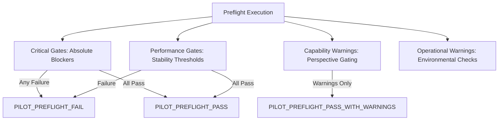

# PILOT PREFLIGHT GUIDE & ONBOARDING CHECKLIST

## 1. Purpose of Preflight Verification
Before any CCTV camera is permitted to stream into the live orchestration pipeline during the pilot phase, it must pass an automated, deterministic preflight audit. This prevents pipeline crashes, memory exhaustion, silent inference failures, and corrupted evidence recording during active examinations.

---

## 2. Preflight Execution Command
Run the preflight command for a camera profile:
```powershell
.\.venv\Scripts\python.exe scripts/pilot_preflight.py `
    --profile "configs/pilot/camera_profile_template.yaml" `
    --output "runs/pilot/preflight/cam_hall_01.json"
```

---

## 3. Preflight Evaluation Gates

Preflight evaluates four tiers of criteria:



### 3.1. Critical Gates (Must Pass 100%)
Failure in any critical gate halts pipeline initialization with `PILOT_PREFLIGHT_FAIL`:
1. **Checkpoint Hashes Valid**: All physical `.pt` model weights match authoritative SHA-256 digests (`stage1_5_best.pt`, `v4_posture_best.pt`, `v4_headpose_yaw_best.pt`, `yolo26m.pt`).
2. **Models Load Cleanly**: PyTorch loads state dicts into GPU memory without architecture or dimension mismatches.
3. **GPU & CUDA Operational**: NVIDIA CUDA runtime is available and healthy (tested on RTX 5070, CUDA 13.0).
4. **Camera Source Reachable**: Video file exists or RTSP network endpoint responds within handshake timeout.
5. **General Person Detector Functional**: `yolo26m.pt` processes test tensor and detects person class.
6. **ByteTrack Tracker Operational**: Multi-frame bounding box tracking initializes and updates track states.
7. **Storage Directory Writable**: Target evidence directories (`runs/pilot/evidence/`) are writable.
8. **Storage Quota Non-Exhausted**: Free disk space exceeds critical margin ($> 1.0\text{ GB}$).

### 3.2. Performance Gates
1. **Source FPS Measured**: Input stream rate measured and verified against nominal profile.
2. **Ingestion Queue Bounded**: Queue does not overflow under nominal load.
3. **Memory Footprint**: Process RSS stays below system safety thresholds.

### 3.3. Capability & Operational Warnings (Non-Blocking)
Cameras emitting warnings receive `PILOT_PREFLIGHT_PASS_WITH_WARNINGS`:
- `HIGH_ANGLE_WARNING`: Ceiling pitch $> 60^\circ$ (head-pose disabled).
- `LOW_PERSON_PIXEL_COVERAGE`: Person bbox height $< 60\text{ px}$.
- `LOW_HEADPOSE_COVERAGE`: Head crops $< 25 \times 25\text{ px}$.
- `RTSP_RECONNECT_UNTESTED`: Stream resilience not validated on site.

---

## 4. Final Verdict Categories
- **`PILOT_PREFLIGHT_PASS`**: All critical and performance gates passed. Zero warnings. Fully approved for pilot.
- **`PILOT_PREFLIGHT_PASS_WITH_WARNINGS`**: All critical gates passed. One or more non-blocking capability warnings present (e.g., posture supported, but head-pose disabled due to camera angle). Approved for pilot under bounded profile.
- **`PILOT_PREFLIGHT_FAIL`**: One or more critical gates failed. Camera is **strictly prohibited** from joining the pilot.
