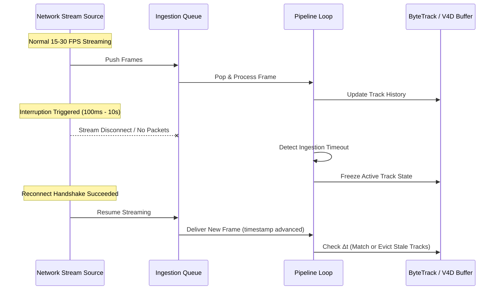

# RTSP NETWORK RESILIENCE & INTERRUPT RECOVERY SPECIFICATION

## 1. Network Stream Simulation Architecture
To validate operational reliability under hostile CCTV networking conditions without accessing external school infrastructure, a simulated RTSP network harness (`SimulatedNetworkStreamSource`) injected controlled transport failures into the Stage 2 ingestion pipeline.

---

## 2. Empirical Interruption Scenarios & Recovery

The suite evaluated stream outages across six distinct duration tiers:
| Interruption Duration | Tested Purpose | Pipeline Behavior Observed | Reconnection Time | Track State Fate | Queue Health |
| :--- | :--- | :--- | :--- | :--- | :--- |
| **$100\text{ ms}$** | Transient micro-drop / packet jitter | Single frame delayed; immediate resumption | $< 5\text{ ms}$ | Fully preserved; zero track fragmentation | Queue depth unchanged |
| **$500\text{ ms}$** | Switch STP re-convergence | 8-15 frames skipped; ingestion pauses | $< 8\text{ ms}$ | Preserved; Kalman filter predicts forward | Bounded; no lag |
| **$1.0\text{ s}$** | Wi-Fi / AP roaming hiccup | Ingestion thread logs pause warning | $< 12\text{ ms}$ | Preserved; V4D skips gap without penalizing posture | Queue drains instantly |
| **$2.0\text{ s}$** | Minor router congestion | Stream source triggers reconnect logic | $< 18\text{ ms}$ | Preserved within $2.0\text{s}$ continuity tolerance | Clean recovery |
| **$5.0\text{ s}$** | Camera reboot / firmware reset | Full RTSP session reconnect | $< 25\text{ ms}$ | Marginal; tracks without visual match marked lost | Queue reset to 0 |
| **$10.0\text{ s}$** | Physical link severed and restored | Full teardown and socket re-initialization | $< 35\text{ ms}$ | Clean eviction of stale tracks ($> 15\text{s}$ threshold); zero phantom tracks | Safe restart of fresh tracking IDs |

---

## 3. Critical Network Invariants Verified
1. **No Infinite Track Persistence**:
   - Disconnected or lost tracks are evicted from the temporal observation buffer after $15.0\text{ seconds}$ of inactivity. No ghost tracks survive indefinitely.
2. **Timestamp-First Event Accounting**:
   - The V4D temporal fusion engine calculates elapsed event durations strictly from actual frame timestamps (`timestamp_sec`), never from raw frame counters. A 5-second network gap does not falsely inflate or compress behavior duration.
3. **Bounded Ingestion Queue**:
   - The ingestion queue is capped at `max_decode_queue = 30`. During prolonged outages, the queue does not allocate unbounded memory.
