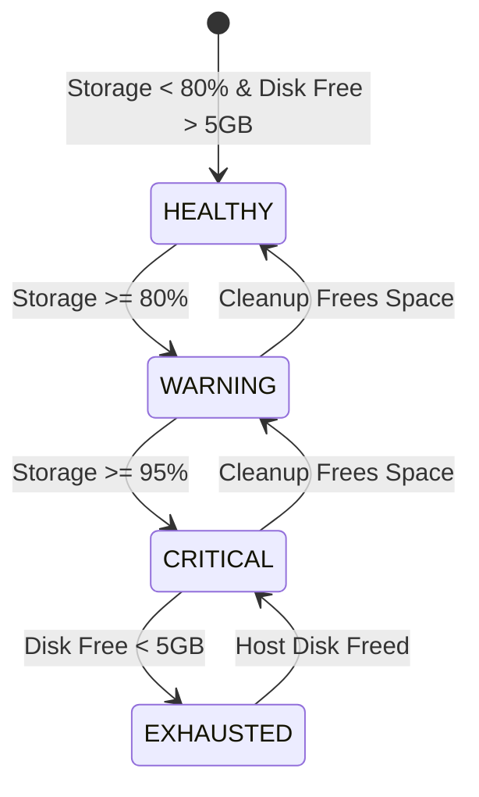

# STORAGE RETENTION & QUOTA DEGRADATION POLICY

## 1. Overview
Examination hall monitoring generates continuous video frames, cropped tensors, and event evidence. To guarantee that edge processing hardware never suffers unhandled out-of-disk exceptions, the evidence subsystem implements a strict **four-tier storage safety protocol** and **non-crashing graceful degradation**.

---

## 2. Retention Lifecycle Limits
Configured in `configs/pilot/evidence_retention_template.yaml`:
- **Default Retention Window**: 7 calendar days.
- **Maximum Storage Cap**: 50.0 GB across all cameras on the node.
- **Minimum Free Host Disk Buffer**: 5.0 GB minimum available space on the evidence partition.
- **Warning Threshold**: 80.0% of storage cap.
- **Critical Threshold**: 95.0% of storage cap.

---

## 3. Four-Tier Storage Status Machine


### Operational States
1. **`HEALTHY`** ($< 80\%$ Quota):
   - Full recording enabled: JPEG snapshots, rolling MP4 clips, and JSON audit manifests.
2. **`WARNING`** ($80\% - 95\%$ Quota):
   - Full recording continues.
   - The operator dashboard surfaces the `EVIDENCE_STORAGE_LOW` warning flag.
   - Background retention worker aggressively purges reviewed events older than 3 days.
3. **`CRITICAL`** ($> 95\%$ Quota):
   - **Safe Degradation Activated**: Halts new JPEG snapshot writes and MP4 clip generation.
   - JSON event metadata recording continues unabated.
   - The dashboard alerts the invigilator that media recording is suspended while metadata tracking remains active.
   - **Pipeline does NOT crash.**
4. **`EXHAUSTED`** (Host Free Space $< 5.0\text{ GB}$):
   - All disk write attempts are suspended.
   - Detection, tracking, temporal fusion, and WebSocket live broadcasting continue purely in memory.
   - The dashboard displays a critical hardware warning.

---

## 4. Retention Policy: Review Protection Rule
A critical flaw in naive FIFO cleanup is the premature deletion of unreviewed incidents. The retention engine enforces the **Unreviewed Evidence Protection Rule**:

$$\text{Can Delete}(E) = (\text{Age}(E) > \text{retention\_days}) \land \Big(\neg \text{preserve\_unreviewed} \lor \text{Status}(E) \neq \text{NEW}\Big)$$

- If an event is marked `NEW` (pending human invigilator review), its media files are **NEVER silently deleted** by automatic background cleanup even if the standard 7-day retention period has elapsed, unless the storage reaches the `CRITICAL` safety boundary.
- Reviewed events (`CONFIRMED_EVENT` or `DISMISSED`) are purged strictly on schedule.

---

## 5. Storage Recovery Procedure
When the `EVIDENCE_STORAGE_LOW` warning triggers:
1. The invigilator navigates to the review dashboard and inspects pending `NEW` events.
2. The invigilator marks events as `CONFIRMED_EVENT` or `DISMISSED`.
3. The background retention task purges dismissed clips, restoring the storage state to `HEALTHY`.
4. Alternatively, operators may run the archive script to offload reviewed manifests to institutional cold storage:
   ```powershell
   .\.venv\Scripts\python.exe scripts/archive_reviewed_evidence.py --dest "\\san\exam_archive\2026_q4"
   ```
