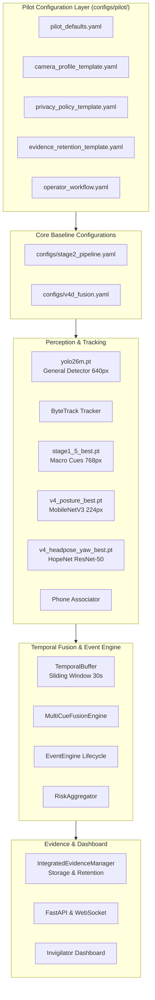

# TARGET CCTV PILOT ARCHITECTURE

## 1. Executive Summary
This document specifies the software, perceptual, and configuration architecture designed for the **Controlled Target CCTV Examination Hall Pilot**. Building upon the verified V4D Temporal Multi-Cue Fusion and Stage 2 Orchestration baseline, this architecture introduces a dedicated pilot layer without modifying trained neural network weights or altering certified core pipeline contracts.

---

## 2. Architectural Principles & Invariants
1. **Governance & Observable Evidence Invariant**:
   - The system is an **observable evidence recorder**, never an autonomous judge.
   - The words `CHEATING`, `CHEATER`, `GUILTY`, or `FRAUD` are strictly prohibited as model outputs, taxonomy labels, database fields, or API responses.
   - All events describe observable physical phenomena (e.g., `SUSTAINED_HEAD_REST`, `SUSTAINED_LATERAL_HEAD_ORIENTATION`, `PHONE_ASSOCIATED`, `DISCUSSION_CANDIDATE`, `STANDING`).
   - Human invigilators retain exclusive authority for behavioral interpretation and disciplinary actions.
2. **Decoupled Perception Hierarchy**:
   - `yolo26m.pt`: General Object Detector (COCO 80 classes, resolving Class 0 `person` and Class 67 `cell phone` dynamically via `model.names`).
   - `ByteTrack`: Multi-object tracker assigning persistent, anonymous track IDs.
   - `models/trained/stage1_5_best.pt`: Macro Behavior Detector (evaluates social/macro cues `stand` and `discuss` at 6.0 Hz cadence; bounding boxes are never treated as generic persons).
   - `models/trained/v4_posture_best.pt`: Posture Classifier (MobileNetV3-Small on tight 224x224 crops, 4-class ontology: `NORMAL_UPRIGHT`, `NORMAL_READ_WRITE`, `HEAD_REST_SLEEP`, `TURN_HEAD_CLEAR`).
   - `models/trained/v4_headpose_yaw_best.pt`: Head-Pose Yaw Estimator (HopeNet ResNet-50 continuous expectation over $[-99.0^\circ, +99.0^\circ)$ horizontal orientation; strictly prohibited from inferring vertical posture states).
3. **Decoupled Phone Spatial Association**:
   - Phone detection is sourced from the primary COCO detector pass without duplicate neural inference.
   - Spatial proximity, IoU overlap, and center-distance gating correlate phone bounding boxes with active student tracks.
   - Ambiguous ownership (`PHONE_ASSOCIATION_AMBIGUOUS`) strictly suppresses event generation.

---

## 3. Configuration Layer Topology
The pilot configuration layer is isolated under `configs/pilot/`:
- `pilot_defaults.yaml`: Site-wide global safeguards, ingestion presets, and fallback limits.
- `camera_profile_template.yaml`: Per-camera hardware, mounting geometry, ROI polygons, and seat zones.
- `privacy_policy_template.yaml`: Privacy governance rules, biometric prohibitions, and recording modes.
- `evidence_retention_template.yaml`: Storage quotas, disk safety thresholds, and auto-cleanup policies.
- `operator_workflow.yaml`: Invigilator review states and real-time operational warning definitions.

These configuration files reference the underlying authoritative engine configurations (`configs/stage2_pipeline.yaml` and `configs/v4d_fusion.yaml`) without overwriting certified model weights or baseline thresholds.

---

## 4. Bounded Ingestion & Backpressure Architecture
To ensure deterministic execution in unpredictable network environments:
- Ingestion is buffered in a `BoundedFrameQueue` with a default capacity of 5 frames.
- When inference latency temporarily exceeds the inter-frame interval, the queue applies `DROP_STALE_ON_BACKPRESSURE`, discarding the oldest unprocessed frame.
- Frame timestamps remain monotonic and physical wall-clock based, preventing temporal event duration corruption.
- Single-branch neural failures degrade that specific cue (e.g., posture unavailable) while allowing the primary tracking loop to continue without crashing.

---

## 5. Summary of Supported Integration Modalities
| Integration Component | Certified Mode | Safe Operational Envelope |
| :--- | :--- | :--- |
| **Video Source** | Offline File / Local Simulated Stream / RTSP | 1080p @ 25 FPS, 1440p @ 20 FPS, 4K @ 15 FPS |
| **Max Track Capacity** | ByteTrack Anonymous IDs | 15 students (stable line rate); 20 students (stress/bounded drops) |
| **Perception Inference** | CUDA 0 (FP32 precision) | Cadence-scheduled GPU batching (max batch 32) |
| **Evidence Output** | JPEG Snapshots & MP4 Clips | Event-triggered only (max 3 snapshots/event) |
| **Operator Interface** | REST API & WebSocket | Real-time review lifecycle: `NEW` $\rightarrow$ `CONFIRMED_EVENT` / `DISMISSED` |
