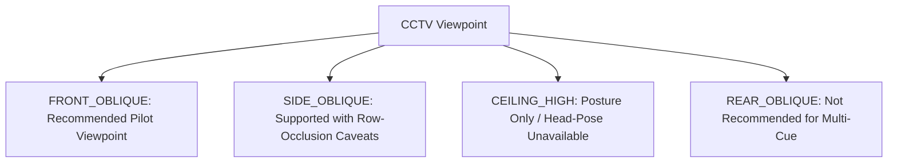

# VIEWPOINT CAPABILITY MATRIX & PERSPECTIVE GUIDELINES

## 1. Overview
In CCTV deployments, camera mounting angle and viewpoint geometry dramatically dictate the visibility of student posture, facial landmarks, and objects. This document establishes empirical capability mappings across four standard CCTV viewpoint classes observed in classroom and exam hall infrastructures.

---

## 2. Standard Viewpoint Taxonomy & Capabilities

### Detailed Viewpoint Matrix
| Viewpoint Profile | Pitch Angle (Nominal) | Posture Visibility | Head-Pose Eligibility | Phone Visibility | Occlusion Characteristics | Pilot Recommendation Status |
| :--- | :--- | :--- | :--- | :--- | :--- | :--- |
| **`FRONT_OBLIQUE`** | $25^\circ - 40^\circ$ downwards | **SUPPORTED_OPTIMAL** (Full torso and head visible) | **SUPPORTED_PRIMARY** (Facial plane clearly resolved, yaw $\pm 90^\circ$ accessible) | Desk surface visible; lap area occluded by desk rim | Low inter-student occlusion; clear separation between desk rows | **RECOMMENDED_PILOT_VIEWPOINT** |
| **`SIDE_OBLIQUE`** | $20^\circ - 35^\circ$ downwards | **SUPPORTED** (Side posture, leaning, slouching evident) | **LIMITED_PROFILE_ONLY** (Near profile resolved; far turning obscured by head self-occlusion) | Near hand/desk visible; far hand occluded by student torso | Moderate to High: students in the same bench row occlude students behind them | **SUPPORTED_WITH_CAVEATS** |
| **`CEILING_HIGH`** | $60^\circ - 85^\circ$ downwards | **SUPPORTED** (Top-down body shape, head rest on desk clearly visible) | **UNAVAILABLE** (Facial plane invisible; top of head only; yaw estimation suppressed) | High for desk surface (birds-eye view of desktop); zero for lap | Low inter-student occlusion; severe perspective foreshortening of torso | **SUPPORTED_WITHOUT_HEADPOSE** |
| **`REAR_OBLIQUE`** | $25^\circ - 45^\circ$ downwards | **SUPPORTED** (Back, shoulders, standing, turning away discernible) | **UNAVAILABLE** (Back of head visible; facial features completely inaccessible) | Very Low: student torso blocks lap, desk, and hands from view | Moderate: student backs obscure work surface | **NOT_RECOMMENDED_FOR_MULTI_CUE** |

---

## 3. Geometric Warning Triggers

During calibration or preflight, the geometry diagnostic module analyzes viewpoint metadata and detected spatial distributions, emitting the following standard operational warnings:

1. **`HIGH_ANGLE_WARNING`**:
   - Emitted when `viewpoint_profile == CEILING_HIGH` or measured camera pitch exceeds $60^\circ$.
   - **Operational Action**: Disables facial head-pose inference branch automatically to save GPU compute and prevent random yaw outputs on hair/crown crops.

2. **`LOW_PERSON_PIXEL_COVERAGE`**:
   - Emitted when $> 50\%$ of tracked students have bounding box height $< 60\text{ px}$.
   - **Operational Action**: Triggers warning flag; marks `POSTURE_CAPABILITY: UNAVAILABLE` or `LIMITED`. Recommends optical zoom adjustment or lower mounting height.

3. **`LOW_HEADPOSE_COVERAGE`**:
   - Emitted when $> 60\%$ of head crops fail the $25 \times 25\text{ px}$ threshold.
   - **Operational Action**: Restricts head-pose weight in V4D fusion to 0.0 or discounted secondary status.

4. **`HIGH_OCCLUSION_RISK`**:
   - Emitted when camera view is `SIDE_OBLIQUE` with expected student count $> 15$, or when bbox overlap frequency exceeds $25\%$.
   - **Operational Action**: Increases ByteTrack lost-track retention window (`track_buffer` 45 frames) to avoid track fragmentations during transient occlusions.

5. **`PHONE_VISIBILITY_LIMITED`**:
   - Emitted for `REAR_OBLIQUE` or `DESK_LEVEL` camera angles where desk surfaces are obstructed by furniture or bodies.
   - **Operational Action**: Advises operator that phone detection is restricted to clear line-of-sight moments only.

---

## 4. Minimum Site Mounting Recommendations
For optimal target CCTV pilot performance:
- **Mount Location**: Corner or front-wall mounting overlooking exam desks at a $30^\circ \pm 5^\circ$ depression angle.
- **Elevation**: $2.8\text{m} - 3.5\text{m}$ above floor level.
- **Coverage**: Maximum 15 simultaneously seated students per 1080p camera; up to 20 students per 1440p camera with sufficient pixel density ($\ge 120\text{ px}$ per student height).
